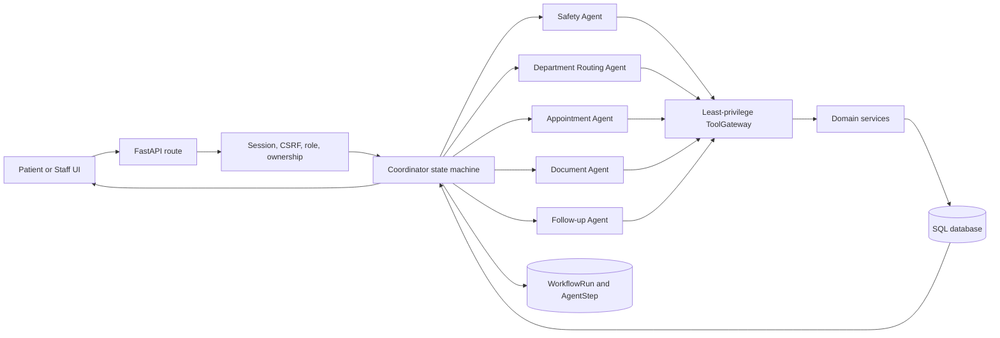

# Architecture

## Runtime Flow



The OpenAI model interprets untrusted text and returns a Pydantic-validated decision. It cannot
issue SQL, access arbitrary files/URLs, choose a user role, or bypass an approval. The coordinator
validates IDs against tool-returned allowlists before executing a mutation.

## Bounded State Machine

```text
intake -> safety -> routing -> [approval] -> appointment
       -> documents -> follow_up -> confirmation -> complete
```

Every completed stage commits its state and `AgentStep`. A failure rolls back that stage, records a
failed step and redacted audit event, leaves `current_step` unchanged, and changes the workflow to
`retry_pending`. Retrying starts at that checkpoint. `MAX_WORKFLOW_STEPS` prevents unbounded loops;
OpenAI calls have bounded exponential retries.

## Agent Distinctness

Prompts live in `app/agents/specialists.py`. Every agent has:

- a unique role, `name`, system prompt, and prompt version;
- a different Pydantic output contract;
- a separate responsibility and least-privilege set in `app/tools.py`;
- persisted inputs, output, model name, tool calls, status, and sequence in `AgentStep`.

The Coordinator does not expose tools directly to the model. It invokes only a validated plan
through `ToolGateway`; the gateway denies cross-agent tool access.

## Important Transactions

- Booking locks the slot, verifies `available`, updates slot status, and creates the appointment in
  one transaction. A unique active `slot_id` protects against concurrent assignments.
- Cancellation releases the slot and cancels scheduled reminders. Rescheduling atomically releases
  the old slot, claims the new one, and versions the appointment.
- Approval stores a canonical SHA-256 payload hash. Staff can approve only the unchanged payload;
  the coordinator performs no gated side effect while approval is pending.
- Document staging checks extension, magic bytes, size, and SHA-256 before private storage. Exact
  duplicate records point to the original object and preserve provenance.
- Reminder idempotency keys prevent duplicate records and notification deliveries.

## Persistence Model

Core tables are defined in `app/models.py` and initialized through Alembic:

`User`, `PatientProfile`, `Department`, `Doctor`, `AppointmentSlot`, `Appointment`,
`PatientRequest`, `PatientDocument`, `WorkflowRun`, `AgentStep`, `Reminder`, `Notification`,
`Escalation`, `ApprovalRequest`, and `AuditEvent`.

`WorkflowRun.state` transfers compact validated facts between agents. Raw document content,
passwords, API keys, and unnecessary profile attributes are never written to agent state or audit.

## Prompt, Context, Harness, and Loop Engineering

- **Prompt:** narrow role instructions, explicit healthcare boundaries, JSON Schema output.
- **Context:** minimum necessary data, valid database options, redacted document previews.
- **Harness:** typed tools, agent allowlists, authorization, transactions, audit, retries, idempotency.
- **Control loop:** explicit state transitions, persisted checkpoints, stop budget, human gates.
- **Evaluation:** deterministic test scenarios for behavior, safety, persistence, and authorization.
